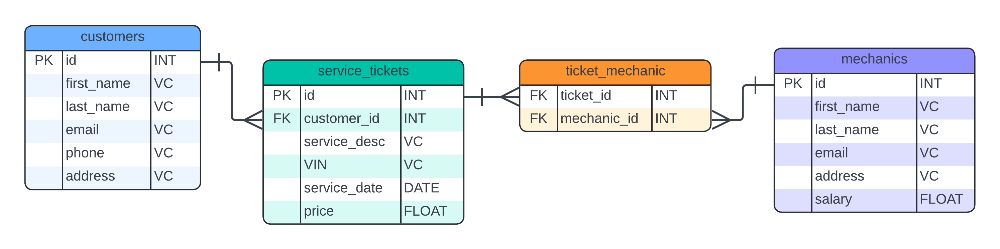

# codingtemple-mechanic-shop

## Part 1: ERD and Flask Models

### Using this ERD, create the foundation of your Flask API by building the database models

- Open VS Code to that project folder
- Inside that folder, create a virtual environment
- Activate the virtual environment
- pip install flask flask-sqlalchemy
- Initialize your flask app app = Flask(__name__)
- Initialize sqlalchemy db = SQLAlchemy(model_class = Base)
- Build your Models, just like we did in sqlalchemy

### ERD

## Part 2: Application Factory Pattern

Hopefully at this point you have been following along with each Practice Assignment and should only have a few pieces left to put into place. Everything from those Practice Assignments will be required in this Knowledge Check.

## Blueprint Setup

Create Blueprint folders for __mechanic__ and __service_ticket__.  
Each Blueprint folder should contain the following files:

- __`__init__.py`__  
  Initialize the Blueprint here.  
  __Don’t forget__ to import the routes into this file __after__ the initialization.

- __`routes.py`__  
  Define all routes specific to that resource.

- __`schemas.py`__  
  Define the Marshmallow schemas used to serialize/deserialize data for the routes.

After creating the blueprints, __register them__ in your `app/__init__.py` file and assign a URL prefix.  
URL prefixes should be the __plural__ name of the resource:

- `/mechanics`
- `/service-tickets`

## Marshmallow Schemas

Define basic schemas for both the `mechanic` and `service_ticket` resources.

You can (and should) take advantage of `SQLAlchemyAutoSchema` to quickly generate schemas based on the models you created.

## Routes

### Mechanic – Full CRUD

With the URL prefix `/mechanics`, most endpoints will use `'/'` or `'/<int:id>'`.

| Method | Endpoint                     | Description                                      |
|--------|------------------------------|--------------------------------------------------|
| POST   | `/`                          | Creates a new Mechanic                           |
| GET    | `/`                          | Retrieves all Mechanics                          |
| PUT    | `/<int:id>`                  | Updates a specific Mechanic by ID                |
| DELETE | `/<int:id>`                  | Deletes a specific Mechanic by ID                |

### Service Ticket – Required Routes

With the URL prefix `/service-tickets`:

| Method | Endpoint                                      | Description                                                                                              |
|--------|-----------------------------------------------|----------------------------------------------------------------------------------------------------------|
| POST   | `/`                                           | Create a new service ticket (pass all required fields)                                                   |
| PUT    | `/<ticket_id>/assign-mechanic/<mechanic_id>`  | Adds a relationship: append the Mechanic to the ticket’s `mechanics` list (use the relationship attribute) |
| PUT    | `/<ticket_id>/remove-mechanic/<mechanic_id>`  | Removes the relationship between the service ticket and the mechanic                                     |
| GET    | `/`                                           | Retrieves all service tickets (should include related mechanics)                                         |

> __Reminder:__ Relationship attributes behave like lists → `ticket.mechanics.append(mechanic)` and `ticket.mechanics.remove(mechanic)` work directly.

## Testing & Postman Collections

As you build each new endpoint:

1. Test it immediately in __Postman__ to verify functionality.
2. Create a __Postman collection__ that contains tests for __all__ endpoints in this project.
3. __Export__ the collection (as a JSON file) and submit it with your assignment.

---

## Links

<https://flask-sqlalchemy.readthedocs.io/en/stable/quickstart/>
<https://github.com/AllanSaleh/Library-Api>
<https://lucid.app/lucidchart/e90d43f4-e89c-4834-b6d5-79d04d65873f/edit?invitationId=inv_a5cd0841-94d9-4c73-aa60-35a3836f3b69>
